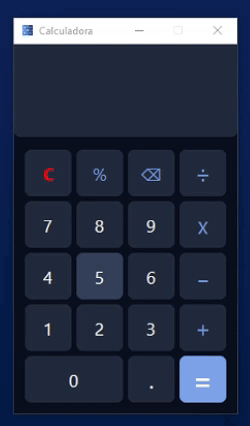

# Simple Calculator using C++ and Qt <h1>
Calculator made using C++ and the Qt framework. A simple project to train logic with C++ and the basics of deployment.

[Download Installer](https://t.ly/qwDlF)

[Download zip file](https://t.ly/9pDlJ)

## 🖩 **Demonstration**

